# Phần chuẩn bị 
## Tổng quan về kit STM32F103C8T6 Blue Pil
- Vi điều khiển chính: STM32F103C8T6 – lõi ARM Cortex-M3, 32-bit, tốc độ tối đa 72 MHz.
- Bộ nhớ: 
	- Flash: 64 KB
	- SRAM: 20 KB
- Giao tiếp hỗ trợ: UART, SPI, I2C, USB, ADC, PWM, GPIO
- Cổng kết nối: Micro USB, 2 hàng chân cắm (40 chân), header SWD để nạp/chạy debug

  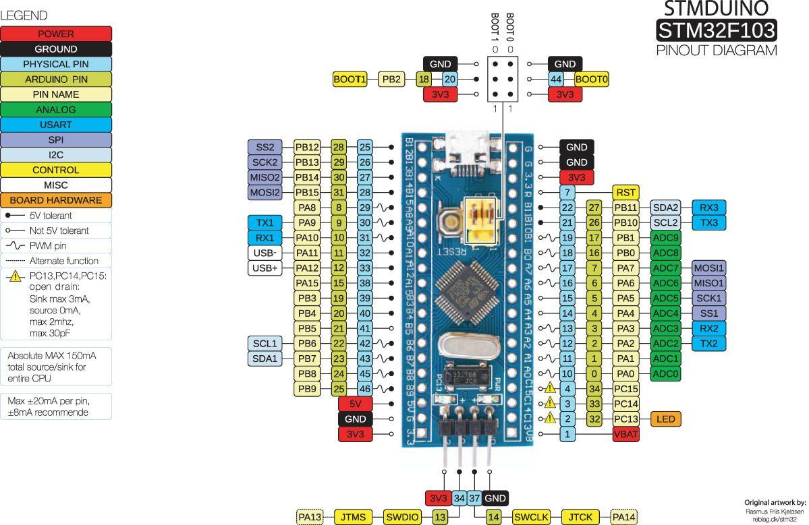

## Thiết bị nạp và debug cho STM32
- ST-Link V2 là gì?
- ST-Link V2 là một thiết bị phần cứng do STMicroelectronics phát triển, dùng để nạp chương trình (flash) và debug cho các vi điều khiển STM32.
- Nó kết nối giữa máy tính và kit STM32 thông qua giao diện SWD (Serial Wire Debug) hoặc JTAG.

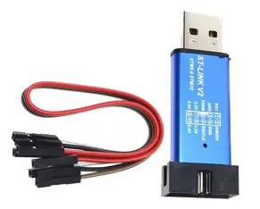

- Vì kit Blue Pill không có mạch nạp tích hợp như Nucleo, nên cần ST-Link để nạp firmware và debug.
- Cài driver cho STlink_v2: [Download Driver STlink v2](https://www.st.com/en/development-tools/stsw-link009.html#get-software)
## Môi trường lập trình

- [Download Keil C](https://drive.google.com/drive/folders/1JvSNEg9syPMFkOoSSPgCbZ4AY4tKe_QA?usp=sharing)

## Hướng dẫn cài 
- B1 : Tìm và chạy MDK531.exe
- B2 : Sau khi cài xong sẽ hiện lên 1 giao diện Pack Install

  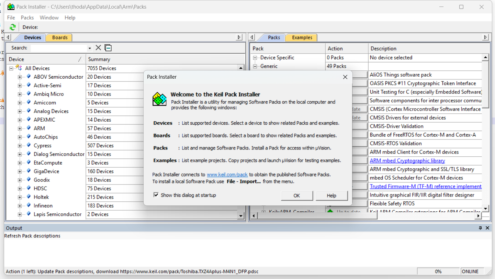

- Có 2 cách cài Device Pack trong Keil
	+ Cài trực tiếp trong Keil (Pack Installer) :
		+ Mở Keil µVision : Project → Manage → Pack Installer. Hoặc nếu mới cài Keil, Pack Installer sẽ tự hiện lên
		+ Ở khung bên trái (Devices), tìm và nhấn vào STMicroelectronics. Trong danh sách hiện ra, chọn STM32F1 Series → STM32F103 → STM32F103C8.
		
		

		  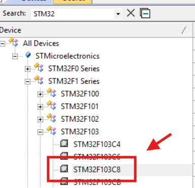
		

		
		+ Ở khung bên phải (Packs), tìm dòng có tên: STMicroelectronics.STM32F1xx_DFP. cài xong Keil nhận diện đúng chip STM32F103C8T6
		
		

		  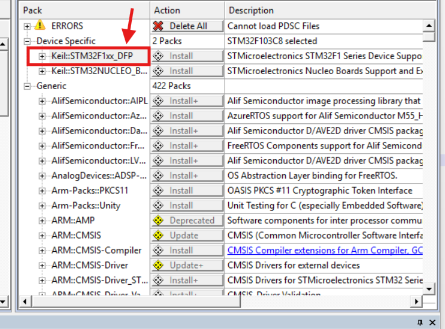
		

		-> Không bị lỗi “missing device support” hay “no startup file”
		-> Có đầy đủ file khởi động (startup), CMSIS, linker scrip. Keil tự động thêm các file cần thiết khi tạo project.
		-> Sẵn sàng build và debug, có thể biên dịch, nạp firmware qua ST-Link, và debug trực tiếp
	+ Cài Device Pack thủ công từ website Keil
		+ Tải về : [Download Device Pack](https://www.keil.arm.com/devices/stmicroelectronics-stm32f103c8/features/)
		

		  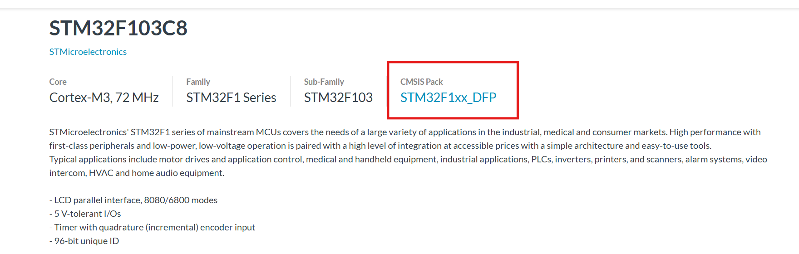
		

- B3 : Sau khi cài xong pack device, chạy phần mềm Keil C với quyền admin -> chọn file -> License Management -> copy CID ví dụ "CF706-LHSSD"
- B4 : vào virus & threat protion -> tắt Real-time protection. Sau đó tìm thư mục "Active2032" chạy file "keygen2032.exe", nhập CID -> chọn ARM -> nhấn Generate để lấy LIC 
như ảnh sau 

	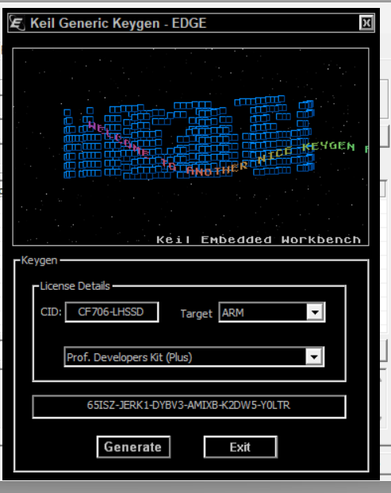

- B5 : Quay lại Keil C copy mã LIC vào rồi add_LIC

	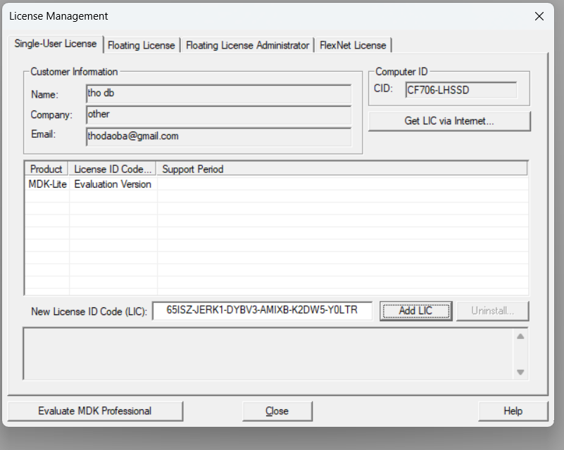

## Tạo project mới
- Vào menu: Project → New µVision Project
- Chọn thư mục lưu project → đặt tên file .uvprojx (ví dụ: BlinkLED.uvprojx)
- Hiển thị ra 1 giao diện select_device -> nhập "stm32f103c8" -> click vào chọn thiết bị -> ok

	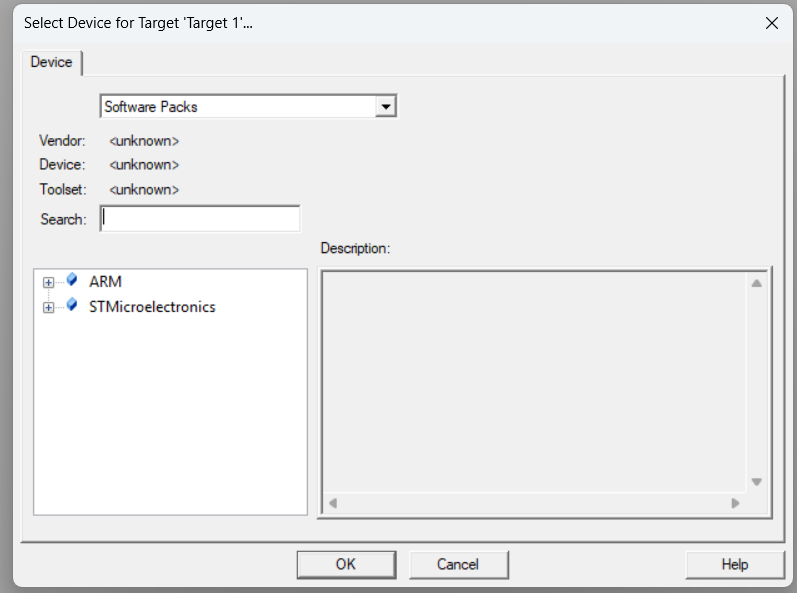

- Tiếp theo Cấu hình project ( giao diện Management Run - time Enviroment ) hiện ra 

	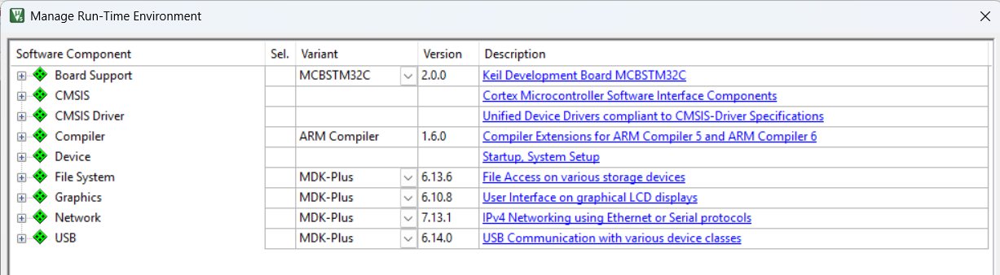

	+ Board Support: Cung cấp thư viện và ví dụ mẫu cho board của Keil như MCBSTM32C. Nếu dùng kit Blue Pill, thì không cần chọn.
	+ CMSIS: Bộ thư viện chuẩn của ARM: định nghĩa lõi Cortex-M, hàm khởi động hệ thống, truy cập thanh ghi. Bắt buộc phải chọn để Keil hiểu cấu trúc chip.
	+ CMSIS Driver: Driver chuẩn cho các ngoại vi như UART, SPI, I2C, GPIO… theo chuẩn CMSIS. Nếu dùng HAL hoặc viết tay, có thể bỏ qua.
	+ Compiler: Cấu hình trình biên dịch ARMCC hoặc ARMCLANG. Giúp Keil hiểu cú pháp và build đúng. Bắt buộc phải chọn.
	+ Device: Chứa file startup, system setup, linker script cho chip STM32F103C8T6. Bắt buộc phải chọn để Keil tạo project đúng.
	+ File System: Thư viện truy cập dữ liệu trên thẻ nhớ, USB, hoặc bộ nhớ ngoài. Chỉ chọn nếu cần lưu/đọc file trong ứng dụng.
	+ Graphics: Thư viện giao diện đồ họa cho màn hình LCD. Chỉ chọn nếu dùng màn hình hiển thị như TFT, OLED.
	+ Network: Thư viện giao tiếp mạng (TCP/IP, Ethernet, PPP…). Chỉ chọn nếu dùng module mạng như ENC28J60, W5500.
	+ USB: Thư viện giao tiếp USB (CDC, HID, MSC…). Chỉ chọn nếu bạn lập trình USB Device hoặc Host trên STM32.
### Cấu hình CMSIS config_cmsis

	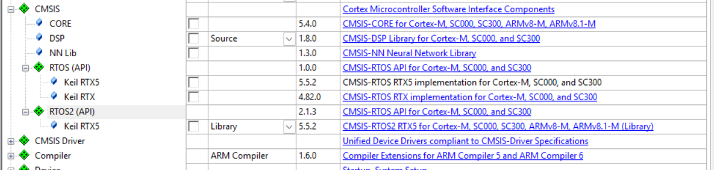

| Thành phần       | Mô tả chức năng                                                                 | Có cần chọn khi làm Blink LED? |
|------------------|----------------------------------------------------------------------------------|-------------------------------|
| **CORE**         | Thư viện lõi: định nghĩa thanh ghi, hàm khởi động hệ thống, truy cập NVIC, SysTick... | ✅ Bắt buộc |
| **DSP**          | Thư viện xử lý tín hiệu số (Digital Signal Processing)                          | ❌ Không cần |
| **NN Lib**       | Thư viện mạng nơ-ron (Neural Network) cho AI trên vi điều khiển                 | ❌ Không cần |
| **RTOS (API)**   | Giao diện lập trình cho hệ điều hành thời gian thực (Keil RTX)                  | ❌ Không cần |
| **RTOS2 (API)**  | Giao diện RTOS thế hệ mới (CMSIS-RTOS2)                                         | ❌ Không cần |
| **CMSIS Driver** | Driver chuẩn cho UART, SPI, I2C, GPIO... theo CMSIS                             | ❌ Không cần nếu viết tay hoặc dùng HAL |
| **Compiler**     | Cấu hình trình biên dịch ARMCC hoặc ARMCLANG                                    | ✅ Bắt buộc |
| **Device**       | File startup, system setup, linker script cho chip STM32F103C8T6                | ✅ Bắt buộc |

### Cấu hình Complier 

	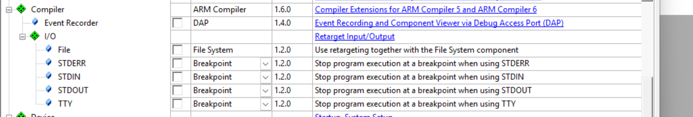

- Vai trò các thành phần Compiler & I/O trong Keil µVision
| Thành phần                     | Mô tả chức năng                                                                 |
|-------------------------------|----------------------------------------------------------------------------------|
| **ARM Compiler**              | Mở rộng hỗ trợ cho ARM Compiler 5 và 6. Bắt buộc để biên dịch mã nguồn ARM.     |
| **DAP (Debug Access Port)**   | Ghi lại sự kiện và hiển thị thông tin debug qua giao diện DAP. Dùng cho phân tích nâng cao. |
| **File System**               | Hỗ trợ retarget I/O khi dùng hệ thống file. Chỉ cần nếu ứng dụng có đọc/ghi file. |
| **STDERR Breakpoint**         | Dừng chương trình tại breakpoint khi sử dụng luồng lỗi chuẩn (STDERR).          |
| **STDIN Breakpoint**          | Dừng chương trình tại breakpoint khi sử dụng luồng nhập chuẩn (STDIN).          |
| **STDOUT Breakpoint**         | Dừng chương trình tại breakpoint khi sử dụng luồng xuất chuẩn (STDOUT).         |
| **TTY Breakpoint**            | Dừng chương trình tại breakpoint khi sử dụng thiết bị đầu cuối (TTY).           |

### Cấu hình device

	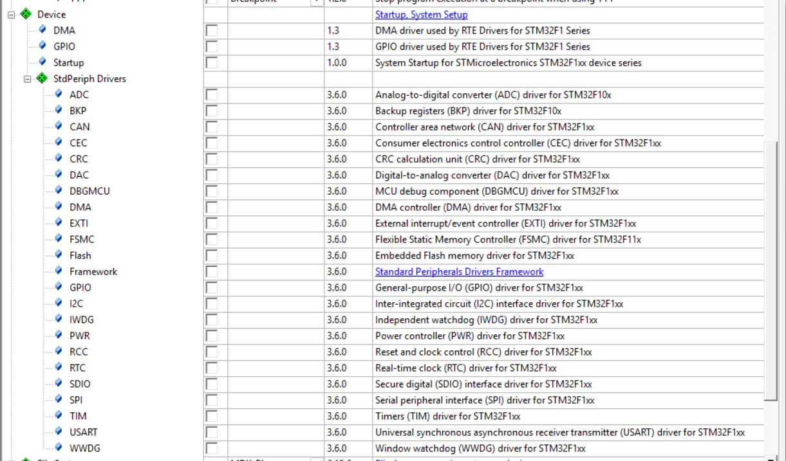

- Vai trò các thành phần Device & StdPeriph Drivers trong Keil µVision

| Thành phần       | Mô tả chức năng                                                                 | Có cần chọn khi làm Blink LED? |
|------------------|----------------------------------------------------------------------------------|-------------------------------|
| **Startup**      | Thêm các file khởi động hệ thống cho STM32F1xx (startup .s, system_stm32f10x.c, linker script). | ✅ Bắt buộc |
| **GPIO (Device)**| Driver GPIO dùng bởi RTE Drivers cho STM32F1 Series (abstract cho CMSIS Driver/RTE). | ❌ Không cần (nếu dùng StdPeriph hoặc truy cập thanh ghi trực tiếp) |
| **DMA (Device)** | Driver DMA dùng bởi RTE Drivers cho STM32F1 Series.                              | ❌ Không cần |
| **ADC**          | Driver cho bộ chuyển đổi tín hiệu tương tự sang số (Analog to Digital Converter). | ❌ Không cần |
| **BKP**          | Driver cho bộ thanh ghi backup, lưu dữ liệu khi mất nguồn.                      | ❌ Không cần |
| **CAN**          | Driver giao tiếp mạng CAN (Controller Area Network).                             | ❌ Không cần |
| **CEC**          | Driver giao tiếp điều khiển thiết bị điện tử tiêu dùng (Consumer Electronics Control). | ❌ Không cần |
| **CRC**          | Driver tính toán kiểm tra lỗi CRC.                                                | ❌ Không cần |
| **DAC**          | Driver cho bộ chuyển đổi số sang tương tự (Digital to Analog Converter).         | ❌ Không cần |
| **DBGMCU**       | Driver hỗ trợ debug MCU.                                                          | ❌ Không cần |
| **DMA (StdPeriph)** | Driver điều khiển truy cập bộ nhớ trực tiếp (Direct Memory Access).           | ❌ Không cần |
| **EXTI**         | Driver cho ngắt ngoài (External Interrupt).                                      | ❌ Không cần |
| **FSMC**         | Driver cho bộ điều khiển bộ nhớ tĩnh linh hoạt (Flexible Static Memory Controller). | ❌ Không cần |
| **Flash**        | Driver thao tác với bộ nhớ Flash nội bộ.                                         | ❌ Không cần |
| **Framework**    | Khung chuẩn cho các driver StdPeriph.                                            | ❌ Không cần |
| **GPIO (StdPeriph)** | Driver điều khiển chân vào/ra số (General Purpose I/O).                      | ✅ Cần nếu dùng thư viện StdPeriph |
| **I2C**          | Driver giao tiếp I2C.                                                             | ❌ Không cần |
| **IWDG**         | Driver cho watchdog độc lập (Independent Watchdog).                              | ❌ Không cần |
| **PWR**          | Driver điều khiển năng lượng (Power Control).                                    | ❌ Không cần |
| **RCC**          | Driver điều khiển reset và clock (Reset and Clock Control).                      | ✅ Cần nếu dùng thư viện StdPeriph |
| **RTC**          | Driver cho đồng hồ thời gian thực (Real-Time Clock).                             | ❌ Không cần |
| **SDIO**         | Driver giao tiếp thẻ nhớ SD.                                                      | ❌ Không cần |
| **SPI**          | Driver giao tiếp SPI.                                                             | ❌ Không cần |
| **TIM**          | Driver điều khiển bộ định thời (Timer).                                          | ❌ Không cần |
| **USART**        | Driver giao tiếp UART/USART.                                                      | ❌ Không cần |
| **WWDG**         | Driver cho watchdog cửa sổ (Window Watchdog).                                    | ❌ Không cần |

- Framework – Khi nào cần, khi nào không cần
	+ Khi cần dùng:
	-> Khi bạn phát triển ứng dụng phức tạp, phải kết hợp nhiều driver StdPeriph (ví dụ: ADC + USART + SPI + TIM).
	-> Khi muốn tận dụng cấu trúc quản lý tập trung mà Framework cung cấp, giúp các driver phối hợp đồng bộ và dễ bảo trì.
	-> Khi dự án yêu cầu tính mở rộng hoặc bạn muốn dựa vào ví dụ mẫu có sẵn từ Keil/ST.
	+ Khi không cần dùng:
	-> Với các project đơn giản như Blink LED, chỉ cần GPIO và RCC là đủ.
	-> Khi bạn viết code trực tiếp bằng thanh ghi hoặc chỉ dùng một vài driver riêng lẻ, không cần khung quản lý.
	-> Nếu muốn giữ project nhẹ, gọn, tránh thêm file và cấu trúc dư thừa.
### Tạo file main.c
- Trước khi tạo file main.c, cần kiểm tra lại debug 

	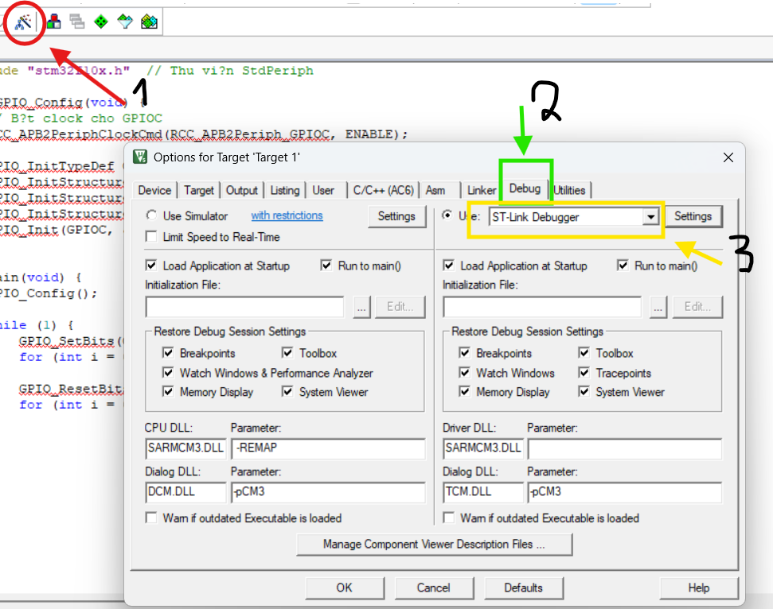

	+ Kiểm tra nhận thiết bị chưa: -> setting 
	

	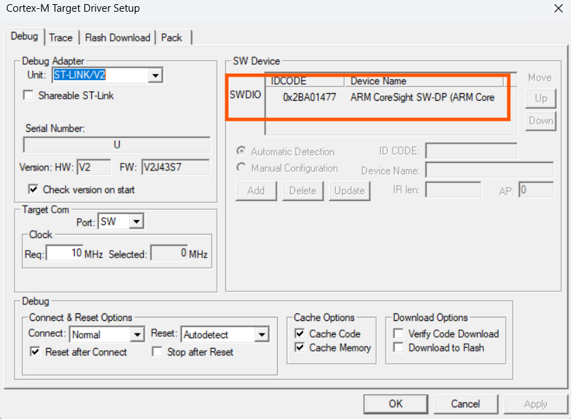
	

	+ flash download:
	

	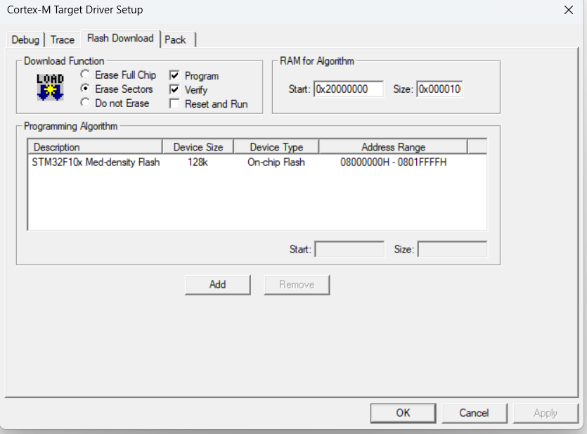
	

	+ Các chức năng chính trong tab Flash Download

| Nhóm chức năng     | Mô tả công dụng                                                                 |
|--------------------|----------------------------------------------------------------------------------|
| **Erase Full Chip**| Xóa toàn bộ bộ nhớ Flash trước khi nạp chương trình mới.                        |
| **Erase Sectors**  | Chỉ xóa các sector (khối nhớ) cần thiết để ghi dữ liệu mới.                     |
| **Do not Erase**   | Không xóa gì cả – dùng khi bạn muốn giữ lại dữ liệu cũ (rất hiếm khi dùng).     |
| **Program**        | Ghi chương trình vào bộ nhớ Flash. ✅ Bắt buộc để nạp code.                      |
| **Verify**         | Kiểm tra lại dữ liệu đã ghi có đúng không bằng cách so sánh với file hex.       |
| **Reset and Run**  | Sau khi nạp xong, reset vi điều khiển và chạy chương trình luôn.                |

- sau khi cấu hình xong 

	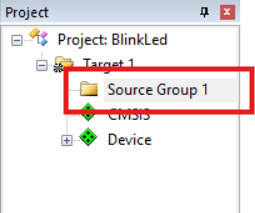

- chuột phải vào mục viền đỏ -> Add new item ... để tạo file 

	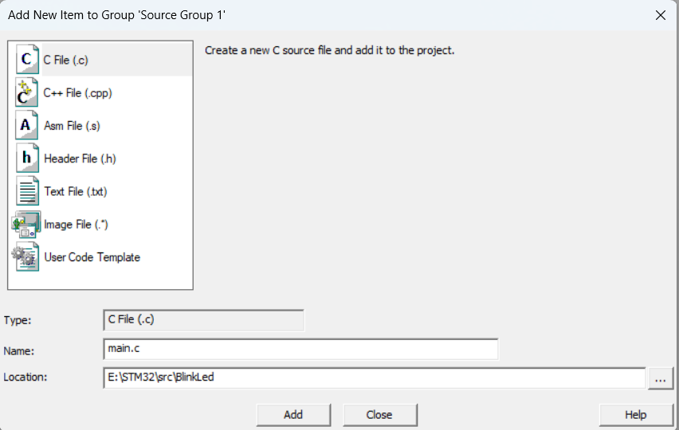

- Khi có mã chương trình -> build -> flash code

	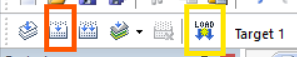

